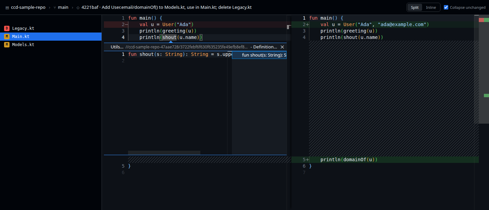
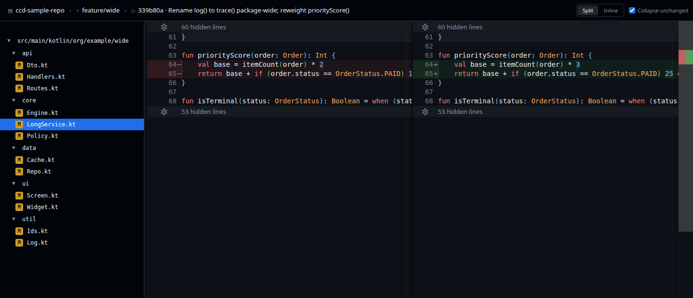
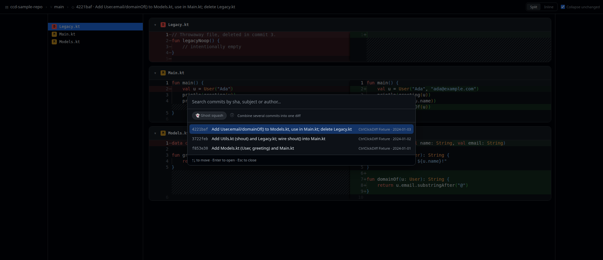

# CtrlClickDiff

**A local, read-only commit reviewer that keeps go-to-declaration *inside* the diff.**

Pick a commit — or several — see a side-by-side diff of the source files it changed, and
**Ctrl+click any symbol to open its declaration in a peek widget right inside the diff.**
Nothing opens in a separate tab. You never lose your place in the review.



*Ctrl+clicking `shout` in `Main.kt` peeks `fun shout` from `Utils.kt` — a different file, opened
inline, without leaving the diff. Esc closes it and puts you back.*

---

## Table of contents

- [The problem it solves](#the-problem-it-solves)
- [What it looks like](#what-it-looks-like)
- [Features](#features)
- [Supported languages](#supported-languages)
- [Requirements](#requirements)
- [Install](#install)
- [Run it](#run-it)
- [Try it in two minutes](#try-it-in-two-minutes)
- [How to use it](#how-to-use-it)
- [Review from an agent](#review-from-an-agent)
- [Configuration](#configuration)
- [Troubleshooting](#troubleshooting)
- [What it deliberately does not do](#what-it-deliberately-does-not-do)
- [Read-only, mechanically](#read-only-mechanically)
- [Under the hood](#under-the-hood)
- [Developing](#developing)

---

## The problem it solves

Reviewing a commit means constantly asking *"what is this thing?"* — and today you have to
choose which half of the answer you get:

- **Plain diff viewers** (GitHub, `git diff`, most git GUIs) show the change but have no idea what
  a symbol *means*. You read `priorityScore(order)` and can't see what it does without going
  somewhere else.
- **IDEs** know exactly what a symbol means — but go-to-declaration **throws you out of the diff**
  into an ordinary editor tab. You lose the review, read the declaration, then have to find your
  way back to where you were.

CtrlClickDiff gives you both at once: a real diff, with language-aware navigation that stays
**in** it.

## What it looks like



A wide change on a feature branch. **Every changed file is stacked in one continuous scroll**, next
file directly below the last, each under a sticky header naming it — so reviewing twelve files is
one gesture, not twelve. The sidebar collapses the deep Kotlin package
`src/main/kotlin/org/example/wide` into a **single row** instead of five nested ones, and unchanged
regions fold away — so a 2-line edit inside a 120-line file is all that's on screen, under a
`60 hidden lines` bar you can click to expand. The header is a breadcrumb of what you're reviewing:
**repo › branch › commit selection**. View toggles sit on the right.



The commit palette. One search box matches **sha, subject and author** at once, and every commit is
labelled `sha · subject · author · date`. Flipping **Ghost squash** turns it into a multi-select, so
you can review several commits as one diff.

## Features

### In-diff code navigation — the whole point

- **Ctrl+click a symbol** (**Cmd** on macOS) and its declaration opens in a **peek widget inline in
  the diff**, whether it's declared in the same file or a different one.
- **Esc** closes the peek and returns you exactly where you were. **F12** opens the declaration's
  file properly, if you'd rather go there.
- Works on both sides of the diff, and in inline mode as well as side-by-side.
- The symbol index is built from **every source file at the revision you're reviewing**, so it finds
  declarations as that commit left them — not as they happen to be on disk now.

### Review a *selection* of commits — "ghost squash"

- Select several commits and read them as **one combined diff**.
- **Skip commits out of the middle of a range.** A docs-only commit in the middle simply disappears
  from a review of the code around it.
- **Nothing is rewritten and nothing is synthesised.** Both sides of every file's diff are revisions
  that already exist in your object database — which is exactly why this stays read-only.
- A file that a commit you *left out* also edited **is still shown, and marked ⚠**, with the
  responsible commits named by subject. A changed file is never silently dropped from a review.

### Getting around

- **Repo picker** — browse your filesystem and switch repositories in-app, with a recents list for
  one-click switching. The backend never needs restarting to review something else.
- **Branch picker** — local and remote-tracking branches, grouped, with the checked-out one marked.
  Copes with a detached HEAD.
- **Commit palette** — the newest 100 commits on the selected ref, searchable.
- **Changed-file tree** — source files only, with `A` / `M` / `D` status badges, and single-child
  directory chains collapsed so a deep package is one row instead of six.

### The diff itself

- **One continuous scroll** over every changed file, not one file at a time. The sidebar tree
  scrolls you to a file and highlights whichever one you've scrolled to; each file's header has a
  chevron to fold that file away.
- **Side-by-side or inline**, toggled live.
- **Unchanged regions collapsed** by default (at `git diff -U3` context), with a toggle to show
  everything.
- Word-level change highlighting and a GitHub Primer dark theme, with contrast checked to WCAG AA
  over the diff tints.
- **Drag-resizable sidebar** — double-click the seam to reset. Sidebar width and both view toggles
  persist across reloads.

### Live updates

- **Commits appear as you make them.** The backend watches the selected repo's refs and pushes
  changes over SSE, so committing in another terminal reaches the picker in about a fifth of a
  second.
- If you're sitting on the newest commit, it follows along. If you're reviewing an older commit — or
  a multi-commit selection you assembled by hand — it leaves your selection alone.

## Supported languages

| Language | Extensions | Grammar |
|---|---|---|
| Kotlin | `.kt` | tree-sitter-kotlin |
| TypeScript | `.ts` | tree-sitter-typescript |
| TypeScript (JSX) | `.tsx` | tree-sitter-typescript (`tsx`) |
| JavaScript | `.js`, `.jsx`, `.mjs`, `.cjs` | tree-sitter-javascript |
| Python | `.py` | tree-sitter-python |
| Java | `.java` | tree-sitter-java |
| Go | `.go` | tree-sitter-go |
| Rust | `.rs` | tree-sitter-rust |
| C | `.c` | tree-sitter-c |
| C++ | `.cpp`, `.cc`, `.cxx`, `.hpp`, `.hh`, `.h` | tree-sitter-cpp |
| C# | `.cs` | tree-sitter-csharp |
| Ruby | `.rb` | tree-sitter-ruby |

Eleven languages, twelve grammars: TypeScript's `.tsx` files parse with a second grammar
(`tsx.wasm`), because the plain TypeScript grammar cannot parse JSX, even though `.ts` and `.tsx`
are one Monaco language and share one declarations query. `.h` is claimed by C++ alone, not C —
see `packages/shared/src/languages.ts` for why. Ctrl+click only resolves within a file's own
language; it never follows an import across languages.

## Requirements

| | |
|---|---|
| **Node** | **22.x** — `.nvmrc` pins it, and `package.json` enforces `>=22 <23` |
| **pnpm** | **11 or newer** (this is a pnpm workspace) |
| **git** | **2.31 or newer** |
| **A browser** | Any modern Chromium or Firefox — it's a local web app |
| **OS** | Linux or macOS (Windows via WSL; `start.sh` is a bash script) |

**No native toolchain is needed** — no JDK, no Kotlin compiler, no Android Studio, no C compiler.
Every grammar ships prebuilt as WebAssembly under `vendor/` — see the table above.

Why git 2.31: the ref watcher uses `git rev-parse --path-format`, and listing a merge commit's files
needs `git log --diff-merges=first-parent`. Both landed in 2.31.

## Install

Step by step, assuming nothing is set up yet.

### 1. Check your git

```bash
git --version        # must be 2.31 or newer
```

### 2. Get Node 22

The repo pins the version in `.nvmrc`, so with [nvm](https://github.com/nvm-sh/nvm) you don't have
to name it:

```bash
nvm install          # reads .nvmrc
nvm use
node --version       # should print v22.x
```

No nvm? Install Node 22 however you normally would — [nodejs.org](https://nodejs.org/) has
installers, and Homebrew (`brew install node@22`), `fnm`, `asdf` and `volta` all work. Anything that
gets you a `node --version` of `v22.x` is fine.

### 3. Enable pnpm

The simplest route is Corepack, which ships with Node and fetches the exact pnpm version this repo
pins:

```bash
corepack enable
```

Alternatively, `npm install -g pnpm`. Either way, check it:

```bash
pnpm --version       # should print 11.x or newer
```

### 4. Get the code and install dependencies

```bash
git clone https://github.com/gr13nka/CtrlClickDiff.git
cd CtrlClickDiff
pnpm install
```

### 5. Check that it works

```bash
pnpm smoke
```

This asserts every registered grammar's WebAssembly loads with a matching ABI, that its tags query
compiles, and that it captures its sample correctly — a per-grammar matrix, not one check. You
should see it run through all twelve grammar keys and end with:

```
[smoke] kotlin OK — captured [Foo, bar]
...
[smoke] all 12 grammars OK
```

Optionally, type-check all three packages:

```bash
pnpm typecheck
```

That's the whole install. There is **no build step** — the backend runs TypeScript directly.

## Run it

```bash
./start.sh                          # start empty; pick a repo in the app
./start.sh ~/path/to/kotlin/repo    # open that repo on first load
```

Then open **<http://localhost:5173>**.

`start.sh` starts both halves — the backend on `:5178` and the Vite dev server on `:5173` — waits
until the backend is actually listening before bringing up the frontend, and **stops both together
on Ctrl+C**. Run `./start.sh --help` for the options.

If you'd rather drive the two processes yourself, use two terminals:

```bash
# Terminal 1 — backend (serves git content + the symbol index on :5178)
REPO_ROOT=/path/to/your/kotlin/repo pnpm dev:backend

# Terminal 2 — frontend (Vite dev server; proxies /api to the backend)
pnpm dev:frontend
```

`REPO_ROOT` is optional in both forms — it only names the repo to open on **first load**. Repos,
branches and commits are all switchable inside the app.

## Try it in two minutes

The repo ships a generator for two throwaway repos, so you can watch every feature work
without pointing it at anything of your own:

```bash
bash fixtures/make-sample-repo.sh   # creates ~/ccd-sample-repo and ~/ccd-sample-repo-2
./start.sh ~/ccd-sample-repo
```

Open <http://localhost:5173>, then: **newest commit → click `Main.kt` → Ctrl+click `shout`.** It
peeks `fun shout` from `Utils.kt` — cross-file, inside the diff. That's the screenshot at the top of
this file.

The fixture is shaped to exercise the UI:

| Where | What it shows off |
|---|---|
| `main` (3 commits) | cross-file peek, and the full `A` / `M` / `D` status matrix |
| `feature/deep-paths` | 6-level Kotlin packages — the file tree's chain collapsing |
| `feature/wide` | 12 files over 5 directories, plus a 120-line file with a 2-line edit buried in the middle — the only thing that makes collapsed unchanged regions visible |
| `~/ccd-sample-repo-2` | a second repo, for the repo picker |

`main`'s three commits have pinned dates, so their SHAs come out identical on every machine.

## How to use it

The review loop follows the breadcrumb in the header, left to right:

**repo › branch › commit(s)** → click a changed file → **Ctrl+click** symbols to read it.

1. **Pick a repository.** Click the first breadcrumb chip. You get a directory browser (sandboxed to
   `CCD_BROWSE_ROOT`, default `$HOME`) plus a recents list.
2. **Pick a branch.** Click the second chip. Local branches are grouped before remote-tracking ones,
   and the checked-out branch is marked.
3. **Pick a commit.** Click the third chip for the searchable commit palette. To review several
   commits as one diff, flip **Ghost squash** and tick the ones you want.
4. **Scroll.** Every changed source file is already there, one below the next; clicking a file in the
   sidebar jumps to it.
5. **Ctrl+click any symbol** to peek its declaration inline.

### Gestures

| Do this | To get this |
|---|---|
| **Ctrl+click** a symbol (**Cmd** on macOS) | peek its declaration inline, in the diff |
| **Esc** | close the peek, back to where you were |
| **F12** | scroll to the declaration, if the selection changed that file |
| **Click** a file's header chevron | fold that file away, or bring it back |
| **↑ / ↓** in a palette | move between rows |
| **Enter** in a palette | choose the highlighted row |
| **Esc** in a palette | close it, change nothing |
| **Type** in a palette | filter — commits match on sha, subject *and* author |
| **Click** a directory row | collapse or expand that subtree |
| **Drag** the sidebar edge | resize it (220–640px) |
| **Double-click** the sidebar edge | reset it to the default width |
| **Split / Inline** | two-pane or one-column diff |
| **Collapse unchanged** | fold unchanged regions away, or show everything |

### Reading a ghost squash

When a selection holds more than one commit, each file's diff runs from *before the earliest
selected commit that touched it* to *after the latest one that did*. That's decided per **file**,
not per selection, which is what lets you skip commits from the middle without dragging their edits
into files they never touched.

The one case that can't be exact: a file edited by **both** a selected and a skipped commit has no
two-revision representation, so the skipped commit's edits are unavoidably inside that file's diff.
Those files get a **⚠** — on the sidebar row and on the file's own header — whose tooltip names the
commits responsible, by subject.

## Review from an agent

A coding agent that just finished an iteration can open the review of *its own commits* in
front of you:

```bash
node tools/ccd-review.mjs
```

It works out what the iteration committed, registers the worktree with the backend, prints the
review URL and opens it — as a tab inside [Orca](https://github.com/stablyai/orca)'s embedded
browser when you're running under Orca, so the review lands beside the worktree it belongs to,
and in your desktop browser otherwise. Under Claude Code, `.claude/skills/open-review/` is the
skill that tells the agent to run it.

Its exit code is the interface, because the caller is a program: **0** the review is open,
**2** the iteration left no commits (CtrlClickDiff reviews commits — an uncommitted working
tree isn't something it can show), **1** a real failure, with the reason on stderr.

Flags: `--base=<rev>` to review since a specific revision, `--shas=a,b` for exactly those
commits, `--no-open` to just print the URL, `--json` for the whole answer.

**Sharpening "this iteration".** Without help, the tool reviews everything since your branch
left the default branch — right for a fresh worktree, wider than one iteration on a long-lived
branch. Installing `tools/ccd-session-start.sh` as a `SessionStart` hook records where HEAD was
when the session began, and the tool then reviews exactly what the session added. In
`~/.claude/settings.json`:

```json
{
  "hooks": {
    "SessionStart": [
      { "hooks": [{ "type": "command", "command": "/path/to/CtrlClickDiff/tools/ccd-session-start.sh" }] }
    ]
  }
}
```

Add a `Stop` hook running `node /path/to/CtrlClickDiff/tools/ccd-review.mjs` too, and the review
opens on its own at the end of every turn, with the agent doing nothing.

> Worktrees have to sit inside `CCD_BROWSE_ROOT` (default `$HOME`) — Orca's own live under
> `~/orca/workspaces`, so that works out of the box. A worktree elsewhere needs
> `CCD_BROWSE_ROOT` set to cover it; the tool relays the backend's refusal verbatim when it
> doesn't.

### Deep links

That URL is just a link, and you can build or share one yourself. Every review has one, and the
address bar always holds the current one — copy it, and whoever opens it sees the same review:

```
http://localhost:5173/?path=<absolute repo path>&ref=refs/heads/<branch>&shas=<sha>,<sha>
```

Only `path` is required; `ref` and `shas` fall back to the branch HEAD is on and its newest
commit. The repository is named by **path**, not by id: the backend's registry lives in memory,
so ids don't survive a restart while a path always re-registers to the same one. A link whose
repository the backend refuses reports why and stops — it never quietly opens a different one.

## Configuration

All optional, all environment variables:

| Variable | Default | Meaning |
|---|---|---|
| `REPO_ROOT` | *(none)* | Repo to select on first load. Unset, you pick one in the app. |
| `CCD_BROWSE_ROOT` | `$HOME` | The only directory tree the repo picker may browse or register from. |
| `PORT` | `5178` | Backend port. |

`CCD_BROWSE_ROOT` is a **sandbox, not a convenience**: it bounds what the browser can reach on your
filesystem. `REPO_ROOT` deliberately ignores it — that one is typed by whoever starts the process,
who already has a shell.

> **Note on `PORT`:** the Vite dev proxy targets `127.0.0.1:5178` literally
> (`packages/frontend/vite.config.ts`). If you change `PORT`, change that target too, or `/api`
> calls won't reach the backend. `start.sh` warns you when the two disagree.

## Troubleshooting

**`start.sh` says something is already listening on :5178.**
An earlier backend is still running. `tsx watch` does not always die with the `pnpm` process that
started it, so a previous session can leave one holding the port. Find it with `lsof -i :5178` and
kill it. (`start.sh` avoids creating these itself — it signals whole process groups on exit.)

**I killed the backend by PID and now it won't come back.**
`tsx watch` doesn't respawn a child you killed underneath it. Either restart `start.sh`, or
`touch packages/backend/src/server.ts` to make the watcher rebuild it.

**The page loads but there are no repositories.**
That's the expected empty state when `REPO_ROOT` isn't set — click the first breadcrumb chip and
pick one. If the picker itself shows nothing, check `CCD_BROWSE_ROOT`: it defaults to `$HOME` and
only ever lists **directories**.

**Ctrl+click does nothing.**
Resolution is name-based over your own code at that revision, in a [supported
language](#supported-languages). It won't jump into the standard library or third-party
dependencies, won't follow imports, and won't pick between overloads. If the symbol *is* declared
in a source file in the same repo and nothing happens, check you're holding Ctrl (Cmd on macOS) —
a plain click just moves the cursor.

**New commits aren't appearing.**
Live updates need the SSE stream to be alive; if the backend restarted while the page stayed open,
reload the page. Also note the picker follows the tip only when your selection is a single commit
that *was* the tip — a hand-built multi-commit selection is deliberately left alone.

**`pnpm smoke` fails.**
A grammar's WASM didn't load — the failure names which one. Confirm the file exists under
`vendor/` and that `node --version` is `v22.x`; see `vendor/README.md` to rebuild it.

## What it deliberately does not do

Stated up front so it isn't a disappointment later:

- **Eleven languages, and it's still a closed list.** Kotlin, TypeScript (`.ts` and `.tsx`, via two
  grammars), JavaScript, Python, Java, Go, Rust, C, C++, C# and Ruby — see the table above. Which
  extensions are reviewed and which grammar answers for them is one row per language
  (`packages/shared/src/languages.ts`) rather than scattered literals, but adding a row still means
  vendoring a multi-megabyte grammar, authoring a tags query and adding a smoke sample.
- **Not semantically accurate.** Resolution is by **name**: no overload resolution, no import
  following, no jumps into the stdlib or libraries. It's built for "jump to the declaration in my own
  code", and it tells you when a name is ambiguous.
- **No editing, staging, or committing.** It's a reviewer, not a git client — see below.
- **No auth and no remote access.** It binds to `127.0.0.1` and assumes one trusted local user.
- **No light mode** — dark only.
- **No find-references, rename, or hover** beyond what Monaco does by itself.
- **No desktop packaging.** It's two dev processes and a browser tab.

## Read-only, mechanically

This is a **guarantee, not an aspiration**. The code has no path to write or delete anything:

- **Every git call** goes through one function (`packages/backend/src/git.ts`'s `run()`) using
  `execFile` with an **argument array, never a shell string**, so request input can't inject shell
  commands. The only subcommands invoked anywhere are `log`, `rev-parse`, `for-each-ref`, `show`
  and `grep` — all read-only. Nothing calls `checkout`, `reset`, `clean`, `commit`, `push`, or
  anything that moves a ref.
- **The backend never writes the filesystem.** Its entire fs surface is `readFile` (the WASM
  grammars and tags queries, once at boot), `realpath`/`stat` to validate a repo path, `readdir`
  for the picker, `existsSync`, and `fs.watch` for the change stream. There is no `writeFile`,
  `unlink`, `rm`, `rename` or `mkdir` anywhere in the backend.
- **Directory listing is sandboxed.** `GET /api/browse` is confined to `CCD_BROWSE_ROOT` and returns
  **directory names only** — never file names, contents, sizes or timestamps. Dotfiles are skipped
  and symlinked directories are excluded outright, so a listing can't dangle a path out of the
  sandbox. The requested path and the root are both `realpath`'d before being compared.
- **Registering a repo applies the same check**, after canonicalising the path to its repository
  toplevel — so an allowed-looking subdirectory of a repo that lives *outside* the browse root is
  rejected too. `REPO_ROOT` bypasses this by design: it comes from whoever started the process.
- **The editor is read-only too** — Monaco's diff editor is constructed with `readOnly: true`, so the
  UI can't even be typed into.

## Under the hood

Two processes and a swappable "brain":

- **Frontend** (`packages/frontend`) — TypeScript + Vite +
  [Monaco](https://microsoft.github.io/monaco-editor/)'s `DiffEditor`. A definition provider
  registered per language (`defprovider.ts`) calls the backend and returns a `Location`, which
  Monaco renders as an inline peek. Syntax highlighting for every supported language is built into
  Monaco.
- **Backend** (`packages/backend`) — TypeScript + Fastify, serving git content (`git show`) and a
  symbol index over HTTP.
- **The brain** (`packages/backend/src/resolver`) — a `TreeSitterResolver` behind the one-method
  `SymbolResolver` interface in `packages/shared`. To answer "where is this declared?" it asks
  `git grep` which files mention the identifier at all, then parses just those with
  [tree-sitter](https://tree-sitter.github.io/) (WASM) plus that file's own language's grammar. The
  work is proportional to the identifier rather than to the repository: on a 2,646-file repo a typical
  Ctrl+click reads about seven files instead of all of them. It used to index the whole revision up
  front, which cost 11.5s and ~320 MB *per revision* before the first answer. The interface keeps it
  swappable for a future ctags- or LSP-backed resolver.

Repo scoping is **stateless**: there is no "current repo" on the server. Every data route takes
`?repo=<id>` against an append-only registry of validated paths. Ids are deterministic
(`slug(basename)-sha256(realpath)[0..8]`), so registering is idempotent and an id survives a restart
— which is how the frontend recovers from a `409 repo_not_registered`, by re-registering and retrying
once.

### HTTP API

Every data route takes an optional **`?repo=<id>`**; omitted, it falls back to the boot `REPO_ROOT`.

| Endpoint | Returns |
|---|---|
| `GET /health` | `{ok:true}` |
| `GET /api/repos` | `{ repos: RepoEntry[], defaultRepoId, browseRoot }` |
| `POST /api/repos` `{path}` | `RepoEntry` — validates and registers a repo; idempotent |
| `GET /api/browse?path=` | subdirectories of `path` (default: the browse root), names only |
| `GET /api/branches?repo=` | `BranchInfo[]` — local + remote-tracking branches, full refnames |
| `GET /api/commits?repo=&ref=` | `CommitInfo[]` — newest 100 on `ref` (default `HEAD`) |
| `GET /api/preview?repo=&shas=` | what a commit selection means, per file |
| `GET /api/file?repo=&rev=&path=` | file content at a revision (`""` for the missing side of an add or delete) |
| `GET /api/def?repo=&name=&file=&line=&rev=` | `DefLocation[]` (empty = not found, several = ambiguous) |
| `GET /api/watch?repo=` | SSE — `refs` events on ref change, `ping` every 15s |

`shas` is a comma-separated list, whitelisted against `^[0-9a-f]{40}(,[0-9a-f]{40})*$` at the route
before it can reach git's argv, and capped at 100 entries — the same ceiling as the commit log page
size, because a selection is only ever assembled from commits the picker listed.

## Developing

```
packages/shared     the SymbolResolver contract + wire types (consumed as TS source)
packages/backend    Fastify; git.ts, preview.ts, repos.ts, browse.ts, watch.ts,
                    resolver/TreeSitterResolver.ts
packages/frontend   Vite + Monaco; shell.ts, diff.ts, defprovider.ts, and one module per
                    piece of UI. All CSS is inline in index.html
vendor/             12 prebuilt grammar wasms + build-grammars.sh (how to rebuild them)
fixtures/           make-sample-repo.sh — the reproducible test repos
docs/               the screenshots used in this file
tools/              ccd-review.mjs (open a review of an iteration's commits) and its hook,
                    plus verify-deeplink.mjs
m1-spike/           a throwaway CDN spike that proved peek-in-diff before any real code
```

```bash
pnpm typecheck                      # tsc --noEmit, strict, all three packages
pnpm smoke                          # asserts every registered grammar loads with a matching ABI
bash fixtures/make-sample-repo.sh   # regenerate the fixture repos
node tools/verify-deeplink.mjs      # the deep-link contract, in a real browser (app must be running)
```

There is **no test runner** — behaviour is verified in a real browser, because most of what matters
here (peek rendering inside a diff, region auto-expansion on a jump, drag-resize relayout) has no
meaningful assertion outside one.

**If you're going to change this code, read [`CLAUDE.md`](CLAUDE.md) first.** It records the
constraints that look arbitrary and are not, the bugs that have already been fixed once, and the
reasoning behind decisions a reasonable person would otherwise undo. `TO-DOS.md` tracks anything
still open.
