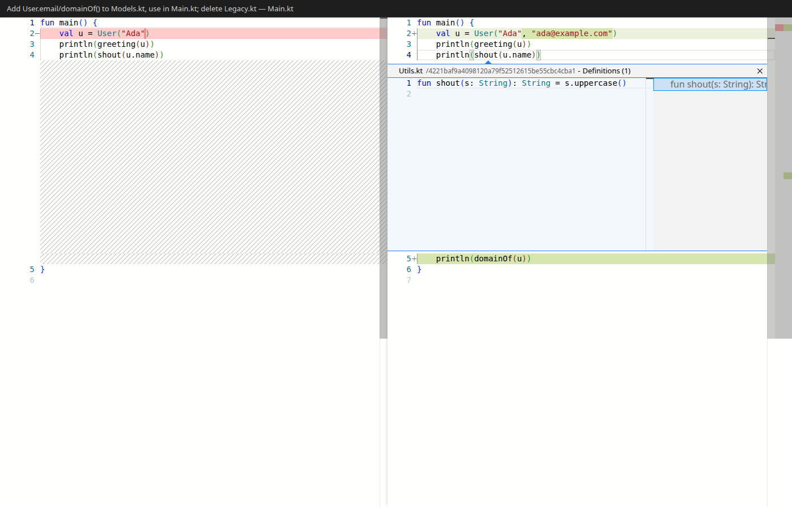

# CtrlClickDiff

A local, fast, **read-only Kotlin commit reviewer**. Pick a commit, see a side-by-side
diff of its changed `.kt` files, and **Ctrl+click any symbol to open its declaration in an
inline peek widget *inside* the diff** — Esc to jump back, F12 to jump to the file. Nothing
opens in a separate editor tab. The whole review, including navigation to declarations,
happens inside the diff.

This fills a real gap: plain diff viewers have no code intelligence, and IDEs have
go-to-declaration but bounce you *out* of the diff to use it. CtrlClickDiff keeps
language-aware navigation **inside the diff view**.



## How it works

Two processes plus a swappable "brain":

- **Frontend** (`packages/frontend`) — TypeScript + Vite + [Monaco](https://microsoft.github.io/monaco-editor/)
  `DiffEditor`. A `registerDefinitionProvider('kotlin', …)` calls the backend and returns a
  `Location`, which Monaco renders as an inline peek (`definitionLinkOpensInPeek`). Kotlin
  highlighting is built into Monaco.
- **Backend** (`packages/backend`) — TypeScript + Fastify. Serves git content (`git show`)
  and a symbol index over HTTP.
- **The brain** (`packages/backend/src/resolver`) — a `TreeSitterResolver` behind the
  `SymbolResolver` interface (`packages/shared`). It parses every `.kt` file at the reviewed
  revision with [tree-sitter](https://tree-sitter.github.io/) (WASM) + a Kotlin grammar,
  builds a `name → declaration location` index, and answers "where is this declared?".
  The interface keeps it swappable (future `CtagsResolver` / `LspResolver`).

Resolution is **name-based** (good for "jump to the declaration in my own Kotlin"), not
semantic — no overload resolution, import following, or jumps into stdlib/library code.

## Prerequisites

- Node **22.x** (`.nvmrc` pins it) and **pnpm** (`corepack enable` or install pnpm 11+).
- No native toolchain needed — the Kotlin grammar ships prebuilt at
  `vendor/tree-sitter-kotlin.wasm` (see `vendor/README.md` to rebuild).

## Setup

```bash
pnpm install
pnpm smoke        # optional: asserts the Kotlin WASM loads with a matching ABI
```

## Run

```bash
# Terminal 1 — backend (serves git + the symbol index on :5178)
REPO_ROOT=/path/to/your/kotlin/repo pnpm dev:backend

# Terminal 2 — frontend (Vite dev server; proxies /api to the backend)
pnpm dev:frontend
```

Open the Vite URL it prints (default http://localhost:5173).

`REPO_ROOT` is **optional** — it names the repo to open on first load, and nothing more. Repos,
branches and commits are all switchable in the app, so the backend never needs restarting to
review something else.

Two environment variables:

| Var | Default | Meaning |
|---|---|---|
| `REPO_ROOT` | *(none)* | Repo to select on first load. If unset, pick one with the repo picker. |
| `CCD_BROWSE_ROOT` | `$HOME` | The only directory tree the repo picker may browse or register from. |
| `PORT` | `5178` | Backend port. |

`CCD_BROWSE_ROOT` is a sandbox, not a convenience: it bounds what the *browser* can reach on
your filesystem. `REPO_ROOT` deliberately ignores it — that one is typed by whoever starts the
process, who already has a shell.

**Using it:** pick a repository from the bar at the top of the sidebar (a directory browser,
with recents for one-click switching) → pick a **branch** → pick a **commit** (labelled
`sha · date · subject`) → click a changed `.kt` file in the sidebar tree → **Ctrl+click**
(Cmd on macOS) a symbol to peek its declaration inline, **Esc** to close the peek, **F12** to
jump to the declaration's file.

The sidebar is drag-resizable (double-click the seam to reset) and groups changed files into a
tree, collapsing single-child directory chains so a deep Kotlin package renders as one row. The
toolbar toggles **side-by-side / inline** diff and **collapse unchanged** regions; both persist.

**Commits appear as you make them.** The backend watches the selected repo's refs and pushes
changes over SSE, so committing in another terminal updates the picker in about a fifth of a
second. If you are sitting on the newest commit it follows along; if you are reviewing an older
one it leaves your selection alone.

Anything still planned is tracked in `TO-DOS.md`.

### Development note

`tsx watch` does not respawn its child if you kill it directly. If you kill the backend by PID
(`lsof -i :5178`), `touch packages/backend/src/server.ts` to bring it back. Killing the
`pnpm dev:backend` wrapper by its top-level PID does not always take the `tsx watch` process
with it, which can leave the old backend bound to 5178.

### Try it with the bundled fixture

```bash
bash fixtures/make-sample-repo.sh          # creates ~/ccd-sample-repo and ~/ccd-sample-repo-2
REPO_ROOT=~/ccd-sample-repo pnpm dev:backend
pnpm dev:frontend
```

Open the newest commit, click `Main.kt`, and Ctrl+click `shout` — it peeks `fun shout` from
`Utils.kt`, cross-file, inside the diff.

The fixture exists to exercise the UI, so it is shaped for it:

| Where | What it demonstrates |
|---|---|
| `main` (3 commits) | cross-file peek, the full `A`/`M`/`D` status matrix |
| `feature/deep-paths` | 6-level Kotlin package paths — the tree's chain collapsing |
| `feature/wide` | 12 files over 5 directories, plus a 120-line file with a 2-line edit in the middle — the only thing that makes collapsed unchanged regions visible |
| `~/ccd-sample-repo-2` | a second repo, different package and class names, for the repo picker |

`main`'s three commits have pinned dates, so their SHAs are reproducible across machines; the
branches are appended after them and never disturb that.

## Layout

```
packages/shared     @ctrlclickdiff/shared  — the SymbolResolver contract + wire types (consumed as TS source)
packages/backend    Fastify + git.ts + resolver/TreeSitterResolver.ts
packages/frontend    Vite + monaco; diff.ts, defprovider.ts, shell.ts
vendor/             prebuilt tree-sitter-kotlin.wasm (+ how to rebuild)
fixtures/           make-sample-repo.sh — a reproducible Kotlin test repo
m1-spike/           throwaway CDN spike that proved peek-in-diff before any real code
```

## HTTP API

Every data route takes an optional **`?repo=<id>`**. Omitted, it falls back to the boot
`REPO_ROOT`; unknown, it answers **409 `repo_not_registered`**, which the frontend treats as
"the backend restarted" — it re-POSTs the repo path and retries once. That works because ids are
deterministic (`slug(basename)-sha256(realpath)[0..8]`), so `POST /api/repos` is idempotent and
an id survives a restart.

| Endpoint | Returns |
|---|---|
| `GET /api/repos` | `{ repos: RepoEntry[], defaultRepoId, browseRoot }` |
| `POST /api/repos` `{path}` | `RepoEntry` — validates and registers a repo; idempotent |
| `GET /api/browse?path=` | subdirectories of `path` (default: the browse root) — directory names only |
| `GET /api/branches?repo=` | `BranchInfo[]` — local + remote-tracking branches, full refnames |
| `GET /api/commits?repo=&ref=` | `CommitInfo[]` (newest 100 on `ref`, default `HEAD`) |
| `GET /api/commit/:sha/files?repo=` | `{ headSha, baseSha, files: ChangedFile[] }` (`.kt` only, `A`/`M`/`D`) |
| `GET /api/file?repo=&rev=&path=` | file content at a revision (`""` for the missing side of added/deleted files) |
| `GET /api/def?repo=&name=&file=&line=&lang=kotlin&rev=` | `DefLocation[]` (empty = not found; multiple = ambiguous) |
| `POST /api/index?repo=&rev=` | prewarm the symbol index for a revision |
| `GET /api/watch?repo=` | SSE — `refs` events (`{headSha}`) on ref change, `ping` every 15s |

## Scope

**In:** Kotlin; side-by-side *and* inline diff; same-file + cross-file peek; name-based
resolution; in-app repo, branch and commit selection; live ref updates; read-only.

**Out:** other languages, semantic accuracy (no overload resolution, import following, or jumps
into stdlib), staging/editing, auth/remote access, desktop packaging, find-references, rename,
hover. The `SymbolResolver` seam keeps the resolver swappable; see `TO-DOS.md` for anything
still open.

Requires **git ≥ 2.31** (`rev-parse --path-format`, used by the ref watcher).

### Read-only, mechanically

"Read-only" isn't just a design intent — the code has no path to write or delete anything:

- Every git call goes through one function (`packages/backend/src/git.ts`'s `run()`) using
  `execFile('git', args, …)` with an **argument array**, never a shell string, so request input
  can't inject shell commands. The only git subcommands ever invoked are `log`, `rev-parse`,
  `diff-tree`, `ls-tree`, `for-each-ref`, and `show` — all read-only plumbing. Nothing calls
  `checkout`, `reset`, `clean`, `commit`, `push`, or any branch-mutating command. Listing
  branches (`for-each-ref`) only *reads* refs; there is no code path that creates, moves, or
  deletes one.
- The backend reads the filesystem and never writes it. Its whole filesystem surface is
  `readFile` (the Kotlin WASM grammar + `tags.scm`, once at boot), `realpath`/`stat` to validate
  a path being registered as a repo, `readdir` to list directories for the repo picker,
  `existsSync`, and `fs.watch` on a repo's `.git` common dir + `.git/refs` for the `/api/watch`
  change stream (which observes writes; it never makes them, and reads no file contents — the
  event only says "look again", and the answer comes from `git` as usual). There is no
  `writeFile`, `unlink`, `rm`, `rename`, or `mkdir` anywhere in `packages/backend` or
  `packages/shared`.
- That directory listing (`GET /api/browse`, `packages/backend/src/browse.ts`) is confined to a
  **browse root** — `CCD_BROWSE_ROOT`, defaulting to `$HOME` — and returns **directory names
  only**. Never file names, never file contents, sizes, or timestamps; entries starting with `.`
  are skipped, and symlinked directories are excluded outright so a listing can't dangle a path
  out of the sandbox. The requested path and the root are both `realpath`'d *before* they are
  compared, which is what stops a symlink from escaping the root.
- `POST /api/repos` is the only way a browser can choose which directory git runs in, and it
  applies the same containment check — after canonicalizing the path to its repository toplevel
  via `git rev-parse --show-toplevel`, so an allowed-looking subdirectory of a repo that lives
  outside the browse root is rejected too. `REPO_ROOT` bypasses this check by design: it is
  supplied by whoever starts the process, not by the browser.
- Monaco's diff editor is created with `readOnly: true` (`packages/frontend/src/diff.ts`), so
  the UI itself can't be typed into either.
